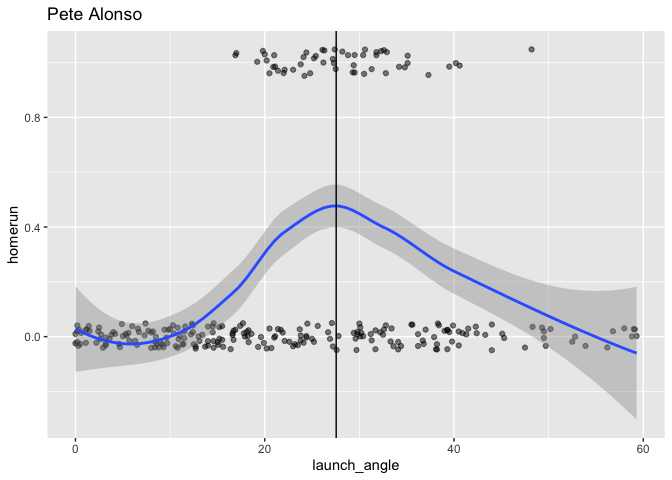
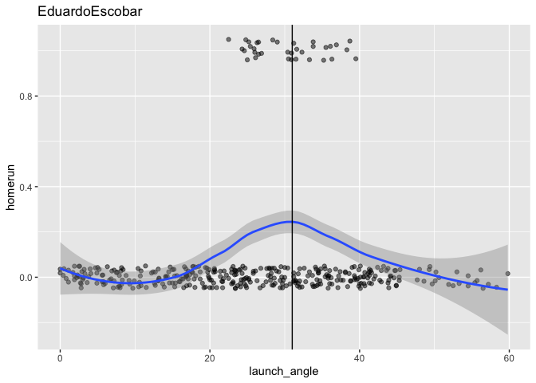
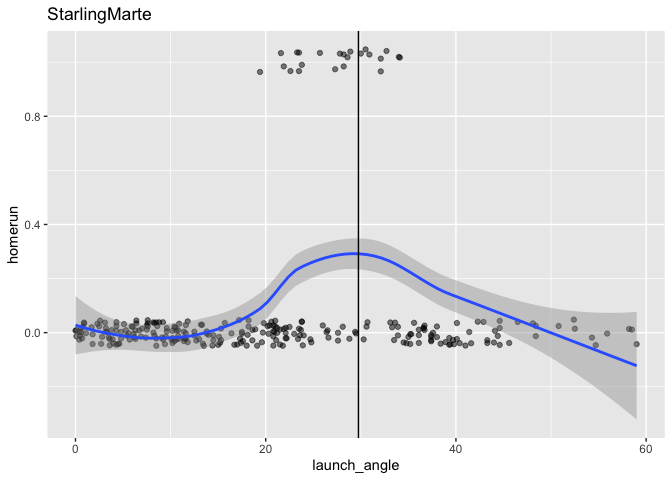
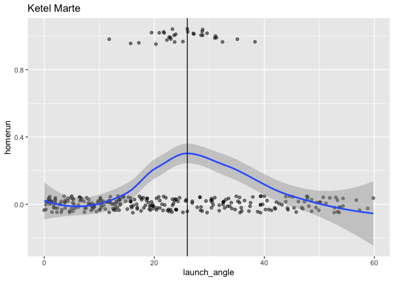

HR\_Probability\_Dbacks
================

``` r
library(dplyr)
```

    ## 
    ## Attaching package: 'dplyr'

    ## The following objects are masked from 'package:stats':
    ## 
    ##     filter, lag

    ## The following objects are masked from 'package:base':
    ## 
    ##     intersect, setdiff, setequal, union

``` r
library(ggplot2)
library(broom)
```

``` r
#Importing CSV of Baseball Savant Data for ABs in 2019

PeteAlonso <- read.csv("PeteAlonso.csv", header = T)
EduardoEscobar <- read.csv("EduardoEscobar.csv", header = T)
StarlingMarte <- read.csv("StarlingMarte.csv", header = T)
KetelMarte <- read.csv("KetelMarte.csv", header = T)
```

``` r
#Adding ESPN's Park Factor Value to the data based on stadium of at-bat
PeteAlonso$park_factor <- ifelse(PeteAlonso$home_team == "COL", 1.394, 
       ifelse(PeteAlonso$home_team == "TEX", 1.245,
              ifelse(PeteAlonso$home_team == "DET", 1.107,
                     ifelse(PeteAlonso$home_team == "WSH", 1.101,
                            ifelse(PeteAlonso$home_team == "BAL", 1.088,
                                   ifelse(PeteAlonso$home_team == "MIA", 1.087,
                                          ifelse(PeteAlonso$home_team == "HOU", 1.083,
        ifelse(PeteAlonso$home_team == "KC", 1.074,
               ifelse(PeteAlonso$home_team == "BOS", 1.063,
                      ifelse(PeteAlonso$home_team == "PHI", 1.047,
                             ifelse(PeteAlonso$home_team == "CIN", 1.038,
                                    ifelse(PeteAlonso$home_team == "TOR", 1.031,
                                           ifelse(PeteAlonso$home_team == "LAA", 1.018,
        ifelse(PeteAlonso$home_team == "PIT", 1.004,
               ifelse(PeteAlonso$home_team == "ATL", 1.003,
                   ifelse(PeteAlonso$home_team == "ARI", 0.977,  
                          ifelse(PeteAlonso$home_team == "MIL", 0.976,
                                 ifelse(PeteAlonso$home_team == "MIN", 0.975,
                                        ifelse(PeteAlonso$home_team == "CLE", 0.972,
        ifelse(PeteAlonso$home_team == "CWS", 0.966,
               ifelse(PeteAlonso$home_team == "SEA", 0.952,
                      ifelse(PeteAlonso$home_team == "CHC", 0.931,
                             ifelse(PeteAlonso$home_team == "STL", 0.917,
                                    ifelse(PeteAlonso$home_team == "LAD", 0.905,
                                           ifelse(PeteAlonso$home_team == "TB", 0.895,
        ifelse(PeteAlonso$home_team == "NYM", 0.891,
               ifelse(PeteAlonso$home_team == "OAK", 0.887,
                      ifelse(PeteAlonso$home_team == "SD", 0.860,
                             ifelse(PeteAlonso$home_team == "NYY", 0.816,
                                    ifelse(PeteAlonso$home_team == "SF", 0.798,
              0.00))))))))))))))))))))))))))))))

EduardoEscobar$park_factor <- ifelse(EduardoEscobar$home_team == "COL", 1.394, 
       ifelse(EduardoEscobar$home_team == "TEX", 1.245,
              ifelse(EduardoEscobar$home_team == "DET", 1.107,
                     ifelse(EduardoEscobar$home_team == "WSH", 1.101,
                            ifelse(EduardoEscobar$home_team == "BAL", 1.088,
                                   ifelse(EduardoEscobar$home_team == "MIA", 1.087,
                                          ifelse(EduardoEscobar$home_team == "HOU", 1.083,
        ifelse(EduardoEscobar$home_team == "KC", 1.074,
               ifelse(EduardoEscobar$home_team == "BOS", 1.063,
                      ifelse(EduardoEscobar$home_team == "PHI", 1.047,
                             ifelse(EduardoEscobar$home_team == "CIN", 1.038,
                                    ifelse(EduardoEscobar$home_team == "TOR", 1.031,
                                           ifelse(EduardoEscobar$home_team == "LAA", 1.018,
        ifelse(EduardoEscobar$home_team == "PIT", 1.004,
               ifelse(EduardoEscobar$home_team == "ATL", 1.003,
                   ifelse(EduardoEscobar$home_team == "ARI", 0.977,  
                          ifelse(EduardoEscobar$home_team == "MIL", 0.976,
                                 ifelse(EduardoEscobar$home_team == "MIN", 0.975,
                                        ifelse(EduardoEscobar$home_team == "CLE", 0.972,
        ifelse(EduardoEscobar$home_team == "CWS", 0.966,
               ifelse(EduardoEscobar$home_team == "SEA", 0.952,
                      ifelse(EduardoEscobar$home_team == "CHC", 0.931,
                             ifelse(EduardoEscobar$home_team == "STL", 0.917,
                                    ifelse(EduardoEscobar$home_team == "LAD", 0.905,
                                           ifelse(EduardoEscobar$home_team == "TB", 0.895,
        ifelse(EduardoEscobar$home_team == "NYM", 0.891,
               ifelse(EduardoEscobar$home_team == "OAK", 0.887,
                      ifelse(EduardoEscobar$home_team == "SD", 0.860,
                             ifelse(EduardoEscobar$home_team == "NYY", 0.816,
                                    ifelse(EduardoEscobar$home_team == "SF", 0.798,
              0.00))))))))))))))))))))))))))))))

StarlingMarte$park_factor <- ifelse(StarlingMarte$home_team == "COL", 1.394, 
       ifelse(StarlingMarte$home_team == "TEX", 1.245,
              ifelse(StarlingMarte$home_team == "DET", 1.107,
                     ifelse(StarlingMarte$home_team == "WSH", 1.101,
                            ifelse(StarlingMarte$home_team == "BAL", 1.088,
                                   ifelse(StarlingMarte$home_team == "MIA", 1.087,
                                      ifelse(StarlingMarte$home_team == "HOU", 1.083,
        ifelse(StarlingMarte$home_team == "KC", 1.074,
               ifelse(StarlingMarte$home_team == "BOS", 1.063,
                      ifelse(StarlingMarte$home_team == "PHI", 1.047,
                             ifelse(StarlingMarte$home_team == "CIN", 1.038,
                                    ifelse(StarlingMarte$home_team == "TOR", 1.031,
                                     ifelse(StarlingMarte$home_team == "LAA", 1.018,
        ifelse(StarlingMarte$home_team == "PIT", 1.004,
               ifelse(StarlingMarte$home_team == "ATL", 1.003,
                   ifelse(StarlingMarte$home_team == "ARI", 0.977,  
                          ifelse(StarlingMarte$home_team == "MIL", 0.976,
                                 ifelse(StarlingMarte$home_team == "MIN", 0.975,
                                      ifelse(StarlingMarte$home_team == "CLE", 0.972,
        ifelse(StarlingMarte$home_team == "CWS", 0.966,
               ifelse(StarlingMarte$home_team == "SEA", 0.952,
                      ifelse(StarlingMarte$home_team == "CHC", 0.931,
                             ifelse(StarlingMarte$home_team == "STL", 0.917,
                                    ifelse(StarlingMarte$home_team == "LAD", 0.905,
                                        ifelse(StarlingMarte$home_team == "TB", 0.895,
        ifelse(StarlingMarte$home_team == "NYM", 0.891,
               ifelse(StarlingMarte$home_team == "OAK", 0.887,
                      ifelse(StarlingMarte$home_team == "SD", 0.860,
                             ifelse(StarlingMarte$home_team == "NYY", 0.816,
                                    ifelse(StarlingMarte$home_team == "SF", 0.798,
              0.00))))))))))))))))))))))))))))))

KetelMarte$park_factor <- ifelse(KetelMarte$home_team == "COL", 1.394, 
       ifelse(KetelMarte$home_team == "TEX", 1.245,
              ifelse(KetelMarte$home_team == "DET", 1.107,
                     ifelse(KetelMarte$home_team == "WSH", 1.101,
                            ifelse(KetelMarte$home_team == "BAL", 1.088,
                                   ifelse(KetelMarte$home_team == "MIA", 1.087,
                                      ifelse(KetelMarte$home_team == "HOU", 1.083,
        ifelse(KetelMarte$home_team == "KC", 1.074,
               ifelse(KetelMarte$home_team == "BOS", 1.063,
                      ifelse(KetelMarte$home_team == "PHI", 1.047,
                             ifelse(KetelMarte$home_team == "CIN", 1.038,
                                    ifelse(KetelMarte$home_team == "TOR", 1.031,
                                     ifelse(KetelMarte$home_team == "LAA", 1.018,
        ifelse(KetelMarte$home_team == "PIT", 1.004,
               ifelse(KetelMarte$home_team == "ATL", 1.003,
                   ifelse(KetelMarte$home_team == "ARI", 0.977,  
                          ifelse(KetelMarte$home_team == "MIL", 0.976,
                                 ifelse(KetelMarte$home_team == "MIN", 0.975,
                                      ifelse(KetelMarte$home_team == "CLE", 0.972,
        ifelse(KetelMarte$home_team == "CWS", 0.966,
               ifelse(KetelMarte$home_team == "SEA", 0.952,
                      ifelse(KetelMarte$home_team == "CHC", 0.931,
                             ifelse(KetelMarte$home_team == "STL", 0.917,
                                    ifelse(KetelMarte$home_team == "LAD", 0.905,
                                        ifelse(KetelMarte$home_team == "TB", 0.895,
        ifelse(KetelMarte$home_team == "NYM", 0.891,
               ifelse(KetelMarte$home_team == "OAK", 0.887,
                      ifelse(KetelMarte$home_team == "SD", 0.860,
                             ifelse(KetelMarte$home_team == "NYY", 0.816,
                                    ifelse(KetelMarte$home_team == "SF", 0.798,
              0.00))))))))))))))))))))))))))))))

#Creating Dummy Homerun Variable
PeteAlonso$homerun <- ifelse(PeteAlonso$events == "home_run", 1, 0)
EduardoEscobar$homerun <- ifelse(EduardoEscobar$events == "home_run", 1, 0)
StarlingMarte$homerun <- ifelse(StarlingMarte$events == "home_run", 1, 0)
KetelMarte$homerun <- ifelse(KetelMarte$events == "home_run", 1, 0)
```

``` r
#Data formatting

#Replacing nulls with NA
PeteAlonso$launch_angle[PeteAlonso$launch_angle == "null"] <- NA
PeteAlonso$launch_speed[PeteAlonso$launch_speed == "null"] <- NA
PeteAlonso$effective_speed[PeteAlonso$effective_speed == "null"] <- NA
PeteAlonso$release_spin_rate[PeteAlonso$release_spin_rate == "null"] <- NA
PeteAlonso$hit_distance_sc[PeteAlonso$hit_distance_sc == "null"] <- NA

#changing structure for analysis
PeteAlonso$launch_angle <- as.numeric(as.character(PeteAlonso$launch_angle))
PeteAlonso$launch_speed <- as.numeric(as.character(PeteAlonso$launch_speed))
PeteAlonso$effective_speed <- as.numeric(as.character(PeteAlonso$effective_speed))
PeteAlonso$release_spin_rate <- as.numeric(as.character(PeteAlonso$release_spin_rate))
PeteAlonso$hit_distance_sc <- as.numeric(as.character(PeteAlonso$hit_distance_sc))
```

``` r
#Logistic Regression models
#Standard Logistic Regression Model
glm_Alonso <- glm(homerun ~ launch_angle + launch_speed + effective_speed +   release_spin_rate + park_factor, data = PeteAlonso, family = binomial, na.action = na.exclude)
summary(glm_Alonso)
```

    ## 
    ## Call:
    ## glm(formula = homerun ~ launch_angle + launch_speed + effective_speed + 
    ##     release_spin_rate + park_factor, family = binomial, data = PeteAlonso, 
    ##     na.action = na.exclude)
    ## 
    ## Deviance Residuals: 
    ##      Min        1Q    Median        3Q       Max  
    ## -2.16037  -0.24013  -0.03769  -0.00170   2.69147  
    ## 
    ## Coefficients:
    ##                     Estimate Std. Error z value Pr(>|z|)    
    ## (Intercept)       -3.446e+01  6.055e+00  -5.691 1.26e-08 ***
    ## launch_angle       1.113e-01  1.967e-02   5.660 1.52e-08 ***
    ## launch_speed       3.100e-01  4.456e-02   6.957 3.47e-12 ***
    ## effective_speed    1.341e-02  3.401e-02   0.394    0.693    
    ## release_spin_rate -2.131e-04  6.231e-04  -0.342    0.732    
    ## park_factor       -2.568e+00  1.931e+00  -1.330    0.184    
    ## ---
    ## Signif. codes:  0 '***' 0.001 '**' 0.01 '*' 0.05 '.' 0.1 ' ' 1
    ## 
    ## (Dispersion parameter for binomial family taken to be 1)
    ## 
    ##     Null deviance: 312.60  on 398  degrees of freedom
    ## Residual deviance: 146.23  on 393  degrees of freedom
    ##   (193 observations deleted due to missingness)
    ## AIC: 158.23
    ## 
    ## Number of Fisher Scoring iterations: 8

``` r
#Improved Model using polynomial fitting for launch angle
#Some regressors aren't statisticall significant but I chose to keep them anyways
glm_Alonso2 <- glm(homerun ~ poly(launch_angle, 2, raw=TRUE) + launch_speed + effective_speed:release_spin_rate + park_factor, data = PeteAlonso, family = binomial, na.action = na.exclude)
```

    ## Warning: glm.fit: fitted probabilities numerically 0 or 1 occurred

``` r
summary(glm_Alonso2)
```

    ## 
    ## Call:
    ## glm(formula = homerun ~ poly(launch_angle, 2, raw = TRUE) + launch_speed + 
    ##     effective_speed:release_spin_rate + park_factor, family = binomial, 
    ##     data = PeteAlonso, na.action = na.exclude)
    ## 
    ## Deviance Residuals: 
    ##      Min        1Q    Median        3Q       Max  
    ## -2.06091  -0.01039   0.00000   0.00000   2.64852  
    ## 
    ## Coefficients:
    ##                                      Estimate Std. Error z value Pr(>|z|)    
    ## (Intercept)                        -7.051e+01  1.342e+01  -5.255 1.48e-07 ***
    ## poly(launch_angle, 2, raw = TRUE)1  1.858e+00  3.896e-01   4.770 1.84e-06 ***
    ## poly(launch_angle, 2, raw = TRUE)2 -2.992e-02  6.466e-03  -4.627 3.70e-06 ***
    ## launch_speed                        4.459e-01  8.138e-02   5.479 4.29e-08 ***
    ## park_factor                        -4.152e+00  3.079e+00  -1.349    0.177    
    ## effective_speed:release_spin_rate   8.735e-06  9.974e-06   0.876    0.381    
    ## ---
    ## Signif. codes:  0 '***' 0.001 '**' 0.01 '*' 0.05 '.' 0.1 ' ' 1
    ## 
    ## (Dispersion parameter for binomial family taken to be 1)
    ## 
    ##     Null deviance: 312.605  on 398  degrees of freedom
    ## Residual deviance:  62.472  on 393  degrees of freedom
    ##   (193 observations deleted due to missingness)
    ## AIC: 74.472
    ## 
    ## Number of Fisher Scoring iterations: 12

``` r
#Same model but with distance
glm_Alonso3 <- lm(hit_distance_sc ~ poly(launch_angle,2,raw=TRUE) + launch_speed + effective_speed:release_spin_rate + park_factor, data = PeteAlonso, na.action = na.exclude)

summary(glm_Alonso3)
```

    ## 
    ## Call:
    ## lm(formula = hit_distance_sc ~ poly(launch_angle, 2, raw = TRUE) + 
    ##     launch_speed + effective_speed:release_spin_rate + park_factor, 
    ##     data = PeteAlonso, na.action = na.exclude)
    ## 
    ## Residuals:
    ##     Min      1Q  Median      3Q     Max 
    ## -373.94  -76.57    6.55   72.92  437.32 
    ## 
    ## Coefficients:
    ##                                      Estimate Std. Error t value Pr(>|t|)    
    ## (Intercept)                        -1.801e+02  6.641e+01  -2.712  0.00700 ** 
    ## poly(launch_angle, 2, raw = TRUE)1  4.192e+00  2.546e-01  16.466  < 2e-16 ***
    ## poly(launch_angle, 2, raw = TRUE)2 -1.622e-02  5.499e-03  -2.950  0.00338 ** 
    ## launch_speed                        2.946e+00  3.613e-01   8.156 5.81e-15 ***
    ## park_factor                         2.454e+01  4.861e+01   0.505  0.61391    
    ## effective_speed:release_spin_rate   1.890e-04  1.639e-04   1.153  0.24947    
    ## ---
    ## Signif. codes:  0 '***' 0.001 '**' 0.01 '*' 0.05 '.' 0.1 ' ' 1
    ## 
    ## Residual standard error: 99.16 on 361 degrees of freedom
    ##   (225 observations deleted due to missingness)
    ## Multiple R-squared:  0.5835, Adjusted R-squared:  0.5777 
    ## F-statistic: 101.1 on 5 and 361 DF,  p-value: < 2.2e-16

``` r
#Filtering middle launch angle values
PeteAlonso_middle <- PeteAlonso %>%
  filter(launch_angle >= 0, launch_angle  <= 60)

# scatterplot with jitter
data_space <- ggplot(data = PeteAlonso_middle, aes(y = homerun, x = launch_angle)) + 
      geom_jitter(width = 0, height = 0.05, alpha = 0.5) + ggtitle("Pete Alonso") 
#smooth curve
 data_space +
  geom_smooth() + geom_vline(xintercept = 27.55)
```

    ## `geom_smooth()` using method = 'loess' and formula 'y ~ x'

<!-- -->

``` r
#We see highest point on geom_smooth curve occurs about launch angle = 27.55 degrees
```

``` r
# create new data frame with predictive data
#Used Aaron Nola's 2019 averages (4seam Fb) and Alsonso's average EV
#Saying it's at Citi Field for park factor
new_pitch_Nola <- data.frame(launch_angle = 27.55, launch_speed = 94.7, effective_speed = 89.7, release_spin_rate = 2171, park_factor = 0.891)

# make predictions on probability of a homerun on the given pitch at optimal launch #angle
augment(glm_Alonso2, newdata = new_pitch_Nola, type.predict = "response")
```

    ## # A tibble: 1 x 7
    ##   launch_angle launch_speed effective_speed release_spin_ra… park_factor .fitted
    ##          <dbl>        <dbl>           <dbl>            <dbl>       <dbl>   <dbl>
    ## 1         27.6         94.7            89.7             2171       0.891   0.143
    ## # … with 1 more variable: .se.fit <dbl>

``` r
# 0.1426
# make predictions on expected distance on the given pitch at optimal launch #angle
augment(glm_Alonso3, newdata = new_pitch_Nola, type.predict = "response")
```

    ## # A tibble: 1 x 7
    ##   launch_angle launch_speed effective_speed release_spin_ra… park_factor .fitted
    ##          <dbl>        <dbl>           <dbl>            <dbl>       <dbl>   <dbl>
    ## 1         27.6         94.7            89.7             2171       0.891    261.
    ## # … with 1 more variable: .se.fit <dbl>

``` r
#260.76 feet
```

``` r
#Confusion Matrix to see accuracy
tidy.Alonso <- augment(glm_Alonso2, type.predict = "response") %>%
    mutate(homerun.hat = round(.fitted))
```

    ## Warning in augment_columns(x, data, newdata, type.predict = type.predict, : When
    ## fitting with na.exclude, rows with NA in original data will be dropped unless
    ## those rows are provided in 'data' argument

``` r
tidy.Alonso %>%
  select(homerun, homerun.hat) %>%
  table()
```

    ##        homerun.hat
    ## homerun   0   1
    ##       0 342   4
    ##       1   5  48

``` r
#Data formatting

#Replacing nulls with NA
EduardoEscobar$launch_angle[EduardoEscobar$launch_angle == "null"] <- NA
EduardoEscobar$launch_speed[EduardoEscobar$launch_speed == "null"] <- NA
EduardoEscobar$effective_speed[EduardoEscobar$effective_speed == "null"] <- NA
EduardoEscobar$release_spin_rate[EduardoEscobar$release_spin_rate == "null"] <- NA
EduardoEscobar$hit_distance_sc[EduardoEscobar$hit_distance_sc == "null"] <- NA

#changing structure for analysis
EduardoEscobar$launch_angle <- as.numeric(as.character(EduardoEscobar$launch_angle))
EduardoEscobar$launch_speed <- as.numeric(as.character(EduardoEscobar$launch_speed))
EduardoEscobar$effective_speed <- as.numeric(as.character(EduardoEscobar$effective_speed))
EduardoEscobar$release_spin_rate <- as.numeric(as.character(EduardoEscobar$release_spin_rate))
EduardoEscobar$hit_distance_sc <- as.numeric(as.character(EduardoEscobar$hit_distance_sc))
```

``` r
#Standard Logistic model 
glm_Escobar <- glm(homerun ~ launch_angle + launch_speed + effective_speed + release_spin_rate + park_factor, data = EduardoEscobar, family = binomial, na.action = na.exclude)
```

    ## Warning: glm.fit: fitted probabilities numerically 0 or 1 occurred

``` r
summary(glm_Escobar)
```

    ## 
    ## Call:
    ## glm(formula = homerun ~ launch_angle + launch_speed + effective_speed + 
    ##     release_spin_rate + park_factor, family = binomial, data = EduardoEscobar, 
    ##     na.action = na.exclude)
    ## 
    ## Deviance Residuals: 
    ##      Min        1Q    Median        3Q       Max  
    ## -1.52593  -0.17125  -0.03854  -0.00243   2.82441  
    ## 
    ## Coefficients:
    ##                     Estimate Std. Error z value Pr(>|z|)    
    ## (Intercept)       -4.521e+01  8.079e+00  -5.596 2.19e-08 ***
    ## launch_angle       1.041e-01  2.355e-02   4.420 9.87e-06 ***
    ## launch_speed       4.166e-01  6.780e-02   6.145 7.99e-10 ***
    ## effective_speed   -6.300e-02  3.573e-02  -1.763   0.0779 .  
    ## release_spin_rate  5.085e-04  7.849e-04   0.648   0.5171    
    ## park_factor        3.690e+00  1.527e+00   2.416   0.0157 *  
    ## ---
    ## Signif. codes:  0 '***' 0.001 '**' 0.01 '*' 0.05 '.' 0.1 ' ' 1
    ## 
    ## (Dispersion parameter for binomial family taken to be 1)
    ## 
    ##     Null deviance: 254.07  on 502  degrees of freedom
    ## Residual deviance: 130.38  on 497  degrees of freedom
    ##   (137 observations deleted due to missingness)
    ## AIC: 142.38
    ## 
    ## Number of Fisher Scoring iterations: 9

``` r
#Improved Model using polynomial fitting for launch angle
#Some regressors were highly insignificant so I chose to remove them from model 
glm_Escobar2 <- glm(homerun ~ poly(launch_angle, 2, raw=TRUE) + launch_speed + park_factor, data = EduardoEscobar, family = binomial, na.action = na.exclude)
```

    ## Warning: glm.fit: fitted probabilities numerically 0 or 1 occurred

``` r
summary(glm_Escobar2)
```

    ## 
    ## Call:
    ## glm(formula = homerun ~ poly(launch_angle, 2, raw = TRUE) + launch_speed + 
    ##     park_factor, family = binomial, data = EduardoEscobar, na.action = na.exclude)
    ## 
    ## Deviance Residuals: 
    ##      Min        1Q    Median        3Q       Max  
    ## -1.94938  -0.06567  -0.00024   0.00000   2.56941  
    ## 
    ## Coefficients:
    ##                                     Estimate Std. Error z value Pr(>|z|)    
    ## (Intercept)                        -78.55648   13.38323  -5.870 4.36e-09 ***
    ## poly(launch_angle, 2, raw = TRUE)1   2.11981    0.55134   3.845 0.000121 ***
    ## poly(launch_angle, 2, raw = TRUE)2  -0.03334    0.00885  -3.768 0.000165 ***
    ## launch_speed                         0.42280    0.07807   5.416 6.10e-08 ***
    ## park_factor                          3.32484    1.78435   1.863 0.062416 .  
    ## ---
    ## Signif. codes:  0 '***' 0.001 '**' 0.01 '*' 0.05 '.' 0.1 ' ' 1
    ## 
    ## (Dispersion parameter for binomial family taken to be 1)
    ## 
    ##     Null deviance: 255.08  on 509  degrees of freedom
    ## Residual deviance:  90.48  on 505  degrees of freedom
    ##   (130 observations deleted due to missingness)
    ## AIC: 100.48
    ## 
    ## Number of Fisher Scoring iterations: 12

``` r
#Same model but with distance
glm_Escobar3 <- lm(hit_distance_sc ~ poly(launch_angle,2,raw=TRUE) + launch_speed + park_factor, data = EduardoEscobar, na.action = na.exclude)

summary(glm_Escobar3)
```

    ## 
    ## Call:
    ## lm(formula = hit_distance_sc ~ poly(launch_angle, 2, raw = TRUE) + 
    ##     launch_speed + park_factor, data = EduardoEscobar, na.action = na.exclude)
    ## 
    ## Residuals:
    ##     Min      1Q  Median      3Q     Max 
    ## -209.35  -49.79    7.29   49.92  316.93 
    ## 
    ## Coefficients:
    ##                                      Estimate Std. Error t value Pr(>|t|)    
    ## (Intercept)                        -2.264e+02  3.491e+01  -6.486 2.26e-10 ***
    ## poly(launch_angle, 2, raw = TRUE)1  5.223e+00  2.192e-01  23.831  < 2e-16 ***
    ## poly(launch_angle, 2, raw = TRUE)2 -1.869e-02  6.048e-03  -3.090  0.00212 ** 
    ## launch_speed                        3.372e+00  2.891e-01  11.664  < 2e-16 ***
    ## park_factor                         6.479e+01  2.470e+01   2.623  0.00901 ** 
    ## ---
    ## Signif. codes:  0 '***' 0.001 '**' 0.01 '*' 0.05 '.' 0.1 ' ' 1
    ## 
    ## Residual standard error: 69.86 on 466 degrees of freedom
    ##   (169 observations deleted due to missingness)
    ## Multiple R-squared:  0.7377, Adjusted R-squared:  0.7354 
    ## F-statistic: 327.6 on 4 and 466 DF,  p-value: < 2.2e-16

``` r
#Filtering middle launch angle values
EduardoEscobar_middle <- EduardoEscobar %>%
  filter(launch_angle >= 0, launch_angle  <= 60)

# scatterplot with jitter
data_space <- ggplot(data = EduardoEscobar_middle, aes(y = homerun, x = launch_angle)) + 
      geom_jitter(width = 0, height = 0.05, alpha = 0.5) + ggtitle("EduardoEscobar") 
#smooth curve
 data_space +
  geom_smooth() + geom_vline(xintercept = 31)
```

    ## `geom_smooth()` using method = 'loess' and formula 'y ~ x'

<!-- -->

``` r
 #We see highest point on geom_smooth curve occurs about launch angle = 31 degrees
```

``` r
# create new data frame with predictive data
#Used Clayton Kershaw's 2019 averages (4seam Fb) and Escobar's average EV
#Assume game played at Chase Field
new_pitch_Kershaw <- data.frame(launch_angle = 31, launch_speed = 88, effective_speed = 90.5, release_spin_rate = 2477, park_factor = 0.977)

# make predictions on probability of a homerun on the given pitch at optimal launch #angle
augment(glm_Escobar2, newdata = new_pitch_Kershaw, type.predict = "response")
```

    ## # A tibble: 1 x 7
    ##   launch_angle launch_speed effective_speed release_spin_ra… park_factor .fitted
    ##          <dbl>        <dbl>           <dbl>            <dbl>       <dbl>   <dbl>
    ## 1           31           88            90.5             2477       0.977  0.0118
    ## # … with 1 more variable: .se.fit <dbl>

``` r
# 0.01179

# make predictions on expected distance on the given pitch at optimal launch #angle
augment(glm_Escobar3, newdata = new_pitch_Kershaw, type.predict = "response")
```

    ## # A tibble: 1 x 7
    ##   launch_angle launch_speed effective_speed release_spin_ra… park_factor .fitted
    ##          <dbl>        <dbl>           <dbl>            <dbl>       <dbl>   <dbl>
    ## 1           31           88            90.5             2477       0.977    278.
    ## # … with 1 more variable: .se.fit <dbl>

``` r
#277.5988 feet
```

``` r
#Confusion Matrix
tidy.Escobar <- augment(glm_Escobar2, type.predict = "response") %>%
    mutate(homerun.hat = round(.fitted))
```

    ## Warning in augment_columns(x, data, newdata, type.predict = type.predict, : When
    ## fitting with na.exclude, rows with NA in original data will be dropped unless
    ## those rows are provided in 'data' argument

``` r
tidy.Escobar %>%
  select(homerun, homerun.hat) %>%
  table()
```

    ##        homerun.hat
    ## homerun   0   1
    ##       0 466   9
    ##       1  10  25

``` r
#Data formatting

#Replacing nulls with NA
StarlingMarte$launch_angle[StarlingMarte$launch_angle == "null"] <- NA
StarlingMarte$launch_speed[StarlingMarte$launch_speed == "null"] <- NA
StarlingMarte$effective_speed[StarlingMarte$effective_speed == "null"] <- NA
StarlingMarte$release_spin_rate[StarlingMarte$release_spin_rate == "null"] <- NA
StarlingMarte$hit_distance_sc[StarlingMarte$hit_distance_sc == "null"] <- NA

#changing structure for analysis
StarlingMarte$launch_angle <- as.numeric(as.character(StarlingMarte$launch_angle))
StarlingMarte$launch_speed <- as.numeric(as.character(StarlingMarte$launch_speed))
StarlingMarte$effective_speed <- as.numeric(as.character(StarlingMarte$effective_speed))
StarlingMarte$release_spin_rate <- as.numeric(as.character(StarlingMarte$release_spin_rate))
StarlingMarte$hit_distance_sc <- as.numeric(as.character(StarlingMarte$hit_distance_sc))
```

``` r
#Logistic model 
glm_Marte <- glm(homerun ~ launch_angle + launch_speed + effective_speed + release_spin_rate + park_factor, data = StarlingMarte, family = binomial, na.action = na.exclude)
```

    ## Warning: glm.fit: fitted probabilities numerically 0 or 1 occurred

``` r
summary(glm_Marte)
```

    ## 
    ## Call:
    ## glm(formula = homerun ~ launch_angle + launch_speed + effective_speed + 
    ##     release_spin_rate + park_factor, family = binomial, data = StarlingMarte, 
    ##     na.action = na.exclude)
    ## 
    ## Deviance Residuals: 
    ##      Min        1Q    Median        3Q       Max  
    ## -1.74795  -0.08098  -0.00584  -0.00015   2.45403  
    ## 
    ## Coefficients:
    ##                     Estimate Std. Error z value Pr(>|z|)    
    ## (Intercept)       -5.996e+01  1.418e+01  -4.229 2.35e-05 ***
    ## launch_angle       1.440e-01  3.143e-02   4.580 4.64e-06 ***
    ## launch_speed       4.889e-01  1.046e-01   4.675 2.93e-06 ***
    ## effective_speed    3.921e-02  5.268e-02   0.744    0.457    
    ## release_spin_rate  8.082e-04  1.292e-03   0.626    0.531    
    ## park_factor       -1.009e+00  3.262e+00  -0.309    0.757    
    ## ---
    ## Signif. codes:  0 '***' 0.001 '**' 0.01 '*' 0.05 '.' 0.1 ' ' 1
    ## 
    ## (Dispersion parameter for binomial family taken to be 1)
    ## 
    ##     Null deviance: 173.760  on 430  degrees of freedom
    ## Residual deviance:  80.068  on 425  degrees of freedom
    ##   (110 observations deleted due to missingness)
    ## AIC: 92.068
    ## 
    ## Number of Fisher Scoring iterations: 10

``` r
#Improved Model using polynomial fitting for launch angle
#Park Factor highly insignificant
glm_Marte2 <- glm(homerun ~ poly(launch_angle, 2, raw=TRUE) + launch_speed + effective_speed:release_spin_rate, data = StarlingMarte, family = binomial, na.action = na.exclude)
```

    ## Warning: glm.fit: fitted probabilities numerically 0 or 1 occurred

``` r
summary(glm_Marte2)
```

    ## 
    ## Call:
    ## glm(formula = homerun ~ poly(launch_angle, 2, raw = TRUE) + launch_speed + 
    ##     effective_speed:release_spin_rate, family = binomial, data = StarlingMarte, 
    ##     na.action = na.exclude)
    ## 
    ## Deviance Residuals: 
    ##      Min        1Q    Median        3Q       Max  
    ## -2.86510  -0.00003   0.00000   0.00000   1.52257  
    ## 
    ## Coefficients:
    ##                                      Estimate Std. Error z value Pr(>|z|)    
    ## (Intercept)                        -1.393e+02  3.847e+01  -3.621 0.000293 ***
    ## poly(launch_angle, 2, raw = TRUE)1  3.973e+00  1.287e+00   3.086 0.002029 ** 
    ## poly(launch_angle, 2, raw = TRUE)2 -6.798e-02  2.252e-02  -3.018 0.002541 ** 
    ## launch_speed                        7.642e-01  2.291e-01   3.336 0.000850 ***
    ## effective_speed:release_spin_rate   2.512e-05  2.713e-05   0.926 0.354574    
    ## ---
    ## Signif. codes:  0 '***' 0.001 '**' 0.01 '*' 0.05 '.' 0.1 ' ' 1
    ## 
    ## (Dispersion parameter for binomial family taken to be 1)
    ## 
    ##     Null deviance: 173.76  on 430  degrees of freedom
    ## Residual deviance:  29.86  on 426  degrees of freedom
    ##   (110 observations deleted due to missingness)
    ## AIC: 39.86
    ## 
    ## Number of Fisher Scoring iterations: 14

``` r
#Hit Distance Model had effective speed and release spin rate highly insignificant
glm_Marte3 <- lm(hit_distance_sc ~ poly(launch_angle,2,raw=TRUE) + launch_speed + park_factor, data = StarlingMarte, na.action = na.exclude)

summary(glm_Marte3)
```

    ## 
    ## Call:
    ## lm(formula = hit_distance_sc ~ poly(launch_angle, 2, raw = TRUE) + 
    ##     launch_speed + park_factor, data = StarlingMarte, na.action = na.exclude)
    ## 
    ## Residuals:
    ##     Min      1Q  Median      3Q     Max 
    ## -398.85  -55.05   -4.27   58.19  171.62 
    ## 
    ## Coefficients:
    ##                                      Estimate Std. Error t value Pr(>|t|)    
    ## (Intercept)                        -1.961e+02  5.054e+01  -3.880 0.000122 ***
    ## poly(launch_angle, 2, raw = TRUE)1  3.901e+00  1.747e-01  22.323  < 2e-16 ***
    ## poly(launch_angle, 2, raw = TRUE)2  2.710e-02  4.471e-03   6.061 3.15e-09 ***
    ## launch_speed                        2.359e+00  2.828e-01   8.341 1.23e-15 ***
    ## park_factor                         9.642e+01  4.229e+01   2.280 0.023150 *  
    ## ---
    ## Signif. codes:  0 '***' 0.001 '**' 0.01 '*' 0.05 '.' 0.1 ' ' 1
    ## 
    ## Residual standard error: 80.85 on 397 degrees of freedom
    ##   (139 observations deleted due to missingness)
    ## Multiple R-squared:  0.6651, Adjusted R-squared:  0.6617 
    ## F-statistic: 197.1 on 4 and 397 DF,  p-value: < 2.2e-16

``` r
#Filtering middle launch angle values
StarlingMarte_middle <- StarlingMarte %>%
  filter(launch_angle >= 0, launch_angle  <= 60)

# scatterplot with jitter
data_space <- ggplot(data = StarlingMarte_middle, aes(y = homerun, x = launch_angle)) + geom_jitter(width = 0, height = 0.05, alpha = 0.5) + 
  ggtitle("StarlingMarte")
#smooth curve
 data_space +
  geom_smooth() + geom_vline(xintercept = 29.75)
```

    ## `geom_smooth()` using method = 'loess' and formula 'y ~ x'

<!-- -->

``` r
  #We see highest homerun probability at LA of about 29.75 degrees
```

``` r
# create new data frame with predictive data
#Used Clayton Kershaw's 2019 averages (4seam Fb) and Marte's average EV
#Assume game played at Camden Yards
new_pitch_Kershaw <- data.frame(launch_angle = 29.75, launch_speed = 88.7, effective_speed = 90.5, release_spin_rate = 2477, park_factor = 0.977)

# make predictions on probability of a homerun on the given pitch at optimal launch #angle
augment(glm_Marte2, newdata = new_pitch_Kershaw, type.predict = "response")
```

    ## # A tibble: 1 x 7
    ##   launch_angle launch_speed effective_speed release_spin_ra… park_factor .fitted
    ##          <dbl>        <dbl>           <dbl>            <dbl>       <dbl>   <dbl>
    ## 1         29.8         88.7            90.5             2477       0.977 3.88e-4
    ## # … with 1 more variable: .se.fit <dbl>

``` r
# 0.000387

# make predictions on expected distance on the given pitch at optimal launch #angle
augment(glm_Marte3, newdata = new_pitch_Kershaw, type.predict = "response")
```

    ## # A tibble: 1 x 7
    ##   launch_angle launch_speed effective_speed release_spin_ra… park_factor .fitted
    ##          <dbl>        <dbl>           <dbl>            <dbl>       <dbl>   <dbl>
    ## 1         29.8         88.7            90.5             2477       0.977    247.
    ## # … with 1 more variable: .se.fit <dbl>

``` r
#247.36 feet
```

``` r
#Confusion Matrix
tidy.Marte <- augment(glm_Marte2, type.predict = "response") %>%
    mutate(homerun.hat = round(.fitted))
```

    ## Warning in augment_columns(x, data, newdata, type.predict = type.predict, : When
    ## fitting with na.exclude, rows with NA in original data will be dropped unless
    ## those rows are provided in 'data' argument

``` r
tidy.Marte %>%
  select(homerun, homerun.hat) %>%
  table()
```

    ##        homerun.hat
    ## homerun   0   1
    ##       0 407   2
    ##       1   4  18

``` r
#Data formatting

#Replacing nulls with NA
KetelMarte$launch_angle[KetelMarte$launch_angle == "null"] <- NA
KetelMarte$launch_speed[KetelMarte$launch_speed == "null"] <- NA
KetelMarte$effective_speed[KetelMarte$effective_speed == "null"] <- NA
KetelMarte$release_spin_rate[KetelMarte$release_spin_rate == "null"] <- NA
KetelMarte$hit_distance_sc[KetelMarte$hit_distance_sc == "null"] <- NA
KetelMarte$zone[KetelMarte$zone == "null"] <- NA

#changing structure for analysis
KetelMarte$launch_angle <- as.numeric(as.character(KetelMarte$launch_angle))
KetelMarte$launch_speed <- as.numeric(as.character(KetelMarte$launch_speed))
KetelMarte$effective_speed <- as.numeric(as.character(KetelMarte$effective_speed))
KetelMarte$release_spin_rate <- as.numeric(as.character(KetelMarte$release_spin_rate))
KetelMarte$hit_distance_sc <- as.numeric(as.character(KetelMarte$hit_distance_sc))
KetelMarte$zone <- as.factor(KetelMarte$zone)
```

``` r
#Standard Logistic model 
glm_KMarte <- glm(homerun ~ launch_angle + launch_speed + effective_speed + release_spin_rate + park_factor + zone, data = KetelMarte, family = binomial, na.action = na.exclude)
```

    ## Warning: glm.fit: fitted probabilities numerically 0 or 1 occurred

``` r
summary(glm_KMarte)
```

    ## 
    ## Call:
    ## glm(formula = homerun ~ launch_angle + launch_speed + effective_speed + 
    ##     release_spin_rate + park_factor + zone, family = binomial, 
    ##     data = KetelMarte, na.action = na.exclude)
    ## 
    ## Deviance Residuals: 
    ##      Min        1Q    Median        3Q       Max  
    ## -1.61072  -0.16959  -0.02643  -0.00023   2.97779  
    ## 
    ## Coefficients:
    ##                     Estimate Std. Error z value Pr(>|z|)    
    ## (Intercept)       -2.950e+01  7.401e+00  -3.986 6.71e-05 ***
    ## launch_angle       1.009e-01  2.189e-02   4.612 4.00e-06 ***
    ## launch_speed       3.266e-01  5.681e-02   5.748 9.01e-09 ***
    ## effective_speed   -6.376e-02  4.251e-02  -1.500   0.1337    
    ## release_spin_rate  1.526e-04  7.922e-04   0.193   0.8472    
    ## park_factor       -8.765e-01  1.764e+00  -0.497   0.6192    
    ## zone2             -1.607e+00  1.660e+00  -0.968   0.3330    
    ## zone3             -1.827e+00  1.706e+00  -1.071   0.2843    
    ## zone4             -1.903e+00  1.715e+00  -1.110   0.2670    
    ## zone5             -1.400e+00  1.592e+00  -0.879   0.3792    
    ## zone6             -1.982e+00  1.644e+00  -1.206   0.2279    
    ## zone7             -1.968e+00  1.734e+00  -1.135   0.2562    
    ## zone8             -2.668e+00  1.688e+00  -1.581   0.1139    
    ## zone9             -1.192e+00  1.605e+00  -0.743   0.4577    
    ## zone11            -1.823e+01  3.997e+03  -0.005   0.9964    
    ## zone12            -1.761e+01  3.143e+03  -0.006   0.9955    
    ## zone13            -3.687e+00  2.180e+00  -1.692   0.0907 .  
    ## zone14            -1.880e+01  2.169e+03  -0.009   0.9931    
    ## ---
    ## Signif. codes:  0 '***' 0.001 '**' 0.01 '*' 0.05 '.' 0.1 ' ' 1
    ## 
    ## (Dispersion parameter for binomial family taken to be 1)
    ## 
    ##     Null deviance: 229.15  on 474  degrees of freedom
    ## Residual deviance: 116.47  on 457  degrees of freedom
    ##   (93 observations deleted due to missingness)
    ## AIC: 152.47
    ## 
    ## Number of Fisher Scoring iterations: 19

``` r
#Improved Model using polynomial fitting for launch angle
#Some regressors are highly insignificant so I chose to remove them
glm_KMarte2 <- glm(homerun ~ poly(launch_angle, 2, raw=TRUE) + launch_speed, data = KetelMarte, family = binomial, na.action = na.exclude)
```

    ## Warning: glm.fit: fitted probabilities numerically 0 or 1 occurred

``` r
summary(glm_KMarte2)
```

    ## 
    ## Call:
    ## glm(formula = homerun ~ poly(launch_angle, 2, raw = TRUE) + launch_speed, 
    ##     family = binomial, data = KetelMarte, na.action = na.exclude)
    ## 
    ## Deviance Residuals: 
    ##    Min      1Q  Median      3Q     Max  
    ## -1.827  -0.019   0.000   0.000   3.330  
    ## 
    ## Coefficients:
    ##                                      Estimate Std. Error z value Pr(>|z|)    
    ## (Intercept)                        -62.285899  11.822582  -5.268 1.38e-07 ***
    ## poly(launch_angle, 2, raw = TRUE)1   1.589698   0.367681   4.324 1.54e-05 ***
    ## poly(launch_angle, 2, raw = TRUE)2  -0.027231   0.006691  -4.070 4.71e-05 ***
    ## launch_speed                         0.392271   0.081276   4.826 1.39e-06 ***
    ## ---
    ## Signif. codes:  0 '***' 0.001 '**' 0.01 '*' 0.05 '.' 0.1 ' ' 1
    ## 
    ## (Dispersion parameter for binomial family taken to be 1)
    ## 
    ##     Null deviance: 235.408  on 481  degrees of freedom
    ## Residual deviance:  72.696  on 478  degrees of freedom
    ##   (86 observations deleted due to missingness)
    ## AIC: 80.696
    ## 
    ## Number of Fisher Scoring iterations: 12

``` r
#Same model but with distance
glm_KMarte3 <- lm(hit_distance_sc ~ poly(launch_angle,2,raw=TRUE) + launch_speed + release_spin_rate, data = KetelMarte, na.action = na.exclude)

summary(glm_KMarte3)
```

    ## 
    ## Call:
    ## lm(formula = hit_distance_sc ~ poly(launch_angle, 2, raw = TRUE) + 
    ##     launch_speed + release_spin_rate, data = KetelMarte, na.action = na.exclude)
    ## 
    ## Residuals:
    ##      Min       1Q   Median       3Q      Max 
    ## -308.705  -66.081   -9.334   71.183  264.753 
    ## 
    ## Coefficients:
    ##                                      Estimate Std. Error t value Pr(>|t|)    
    ## (Intercept)                        -1.504e+02  4.221e+01  -3.562 0.000408 ***
    ## poly(launch_angle, 2, raw = TRUE)1  4.119e+00  1.866e-01  22.073  < 2e-16 ***
    ## poly(launch_angle, 2, raw = TRUE)2 -6.315e-03  4.885e-03  -1.293 0.196802    
    ## launch_speed                        2.661e+00  3.211e-01   8.286 1.42e-15 ***
    ## release_spin_rate                   2.085e-02  1.261e-02   1.653 0.098999 .  
    ## ---
    ## Signif. codes:  0 '***' 0.001 '**' 0.01 '*' 0.05 '.' 0.1 ' ' 1
    ## 
    ## Residual standard error: 89.2 on 440 degrees of freedom
    ##   (123 observations deleted due to missingness)
    ## Multiple R-squared:  0.6125, Adjusted R-squared:  0.609 
    ## F-statistic: 173.9 on 4 and 440 DF,  p-value: < 2.2e-16

``` r
#Filtering middle launch angle values
KetelMarte_middle <- KetelMarte %>%
  filter(launch_angle >= 0, launch_angle  <= 60)

# scatterplot with jitter
data_space <- ggplot(data = KetelMarte_middle, aes(y = homerun, x = launch_angle)) +
      geom_jitter(width = 0, height = 0.05, alpha = 0.5) + ggtitle("Ketel Marte") 
#smooth curve
 data_space +
  geom_smooth() + geom_vline(xintercept = 26)
```

    ## `geom_smooth()` using method = 'loess' and formula 'y ~ x'

<!-- -->

``` r
 #We see highest point on geom_smooth curve occurs about launch angle = 26 degrees
```

``` r
# create new data frame with predictive data
#Used Clayton Kershaw's 2019 averages (4seam Fb) and Marte's average EV
#Assume game played at Camden Yards
new_pitch_Kershaw <- data.frame(launch_angle = 26, launch_speed = 88.7, effective_speed = 90.5, release_spin_rate = 2477, park_factor = 0.977)

# make predictions on probability of a homerun on the given pitch at optimal launch #angle
augment(glm_KMarte2, newdata = new_pitch_Kershaw, type.predict = "response")
```

    ## # A tibble: 1 x 7
    ##   launch_angle launch_speed effective_speed release_spin_ra… park_factor .fitted
    ##          <dbl>        <dbl>           <dbl>            <dbl>       <dbl>   <dbl>
    ## 1           26         88.7            90.5             2477       0.977  0.0103
    ## # … with 1 more variable: .se.fit <dbl>

``` r
# 0.0102

# make predictions on expected distance on the given pitch at optimal launch #angle
augment(glm_KMarte3, newdata = new_pitch_Kershaw, type.predict = "response")
```

    ## # A tibble: 1 x 7
    ##   launch_angle launch_speed effective_speed release_spin_ra… park_factor .fitted
    ##          <dbl>        <dbl>           <dbl>            <dbl>       <dbl>   <dbl>
    ## 1           26         88.7            90.5             2477       0.977    240.
    ## # … with 1 more variable: .se.fit <dbl>

``` r
#254.28 feet
```

``` r
#Confusion Matrix
tidy.KMarte <- augment(glm_KMarte2, type.predict = "response") %>%
    mutate(homerun.hat = round(.fitted))
```

    ## Warning in augment_columns(x, data, newdata, type.predict = type.predict, : When
    ## fitting with na.exclude, rows with NA in original data will be dropped unless
    ## those rows are provided in 'data' argument

``` r
tidy.KMarte %>%
  select(homerun, homerun.hat) %>%
  table()
```

    ##        homerun.hat
    ## homerun   0   1
    ##       0 445   5
    ##       1  10  22
